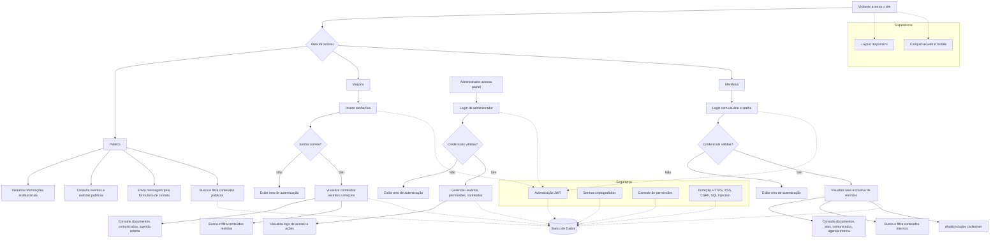

```mermaid
flowchart TD
    A[Visitante acessa o site] --> B{Área de acesso}
    B --> C[Pública]
    B --> D[Maçons]
    B --> E[Membros]

    %% Área Pública
    C --> C1[Visualiza informações institucionais]
    C --> C2[Consulta eventos e notícias públicas]
    C --> C3[Envia mensagem pelo formulário de contato]
    C --> C4[Busca e filtra conteúdos públicos]

    %% Área Maçons
    D --> D1[Insere senha fixa]
    D1 --> D2{Senha correta?}
    D2 -- Não --> D3[Exibe erro de autenticação]
    D2 -- Sim --> D4[Visualiza conteúdos restritos a maçons]
    D4 --> D5[Consulta documentos, comunicados, agenda restrita]
    D4 --> D6[Busca e filtra conteúdos restritos]

    %% Área Membros
    E --> E1[Login com usuário e senha]
    E1 --> E2{Credenciais válidas?}
    E2 -- Não --> E3[Exibe erro de autenticação]
    E2 -- Sim --> E4[Visualiza área exclusiva de membro]
    E4 --> E5[Consulta documentos, atas, comunicados, agenda interna]
    E4 --> E6[Busca e filtra conteúdos internos]
    E4 --> E7[Atualiza dados cadastrais]

    %% Painel Administrativo
    F[Administrador acessa painel]
    F --> F1[Login de administrador]
    F1 --> F2{Credenciais válidas?}
    F2 -- Não --> F3[Exibe erro de autenticação]
    F2 -- Sim --> F4[Gerencia usuários, permissões, conteúdos]
    F4 --> F5[Visualiza logs de acesso e ações]

    %% Banco de Dados
    D4 -.-> G[(Banco de Dados)]
    E4 -.-> G
    F4 -.-> G
    C4 -.-> G

    %% Segurança
    subgraph Segurança
        S1[Autenticação JWT]
        S2[Senhas criptografadas]
        S3[Controle de permissões]
        S4[Proteção HTTPS, XSS, CSRF, SQL Injection]
    end
    D1 -.-> S1
    E1 -.-> S1
    F1 -.-> S1
    S1 -.-> G
    S2 -.-> G
    S3 -.-> G
    S4 -.-> G

    %% Mobile e Responsividade
    subgraph Experiência
        X1[Layout responsivo]
        X2[Compatível web e mobile]
    end
    A -.-> X1
    A -.-> X2
```
